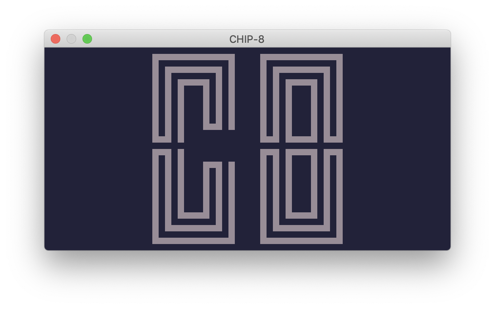
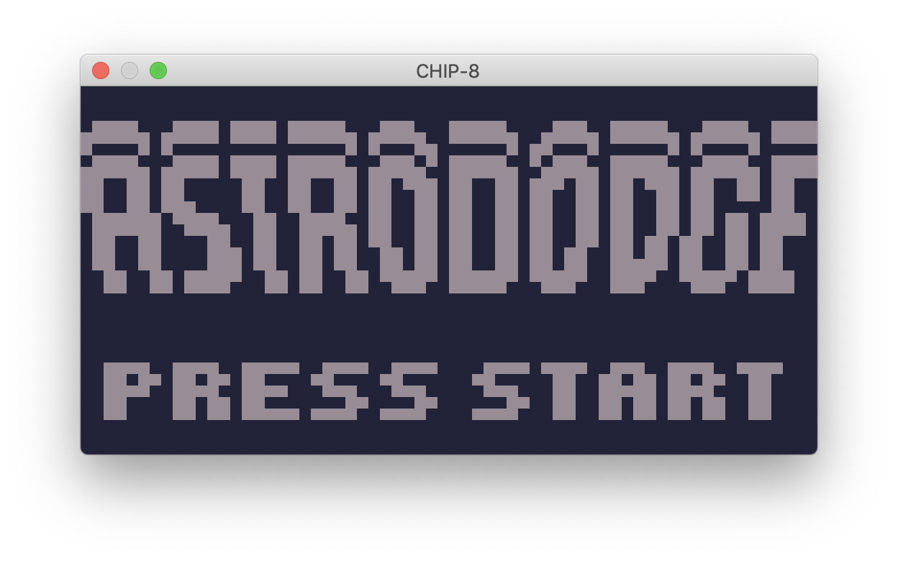
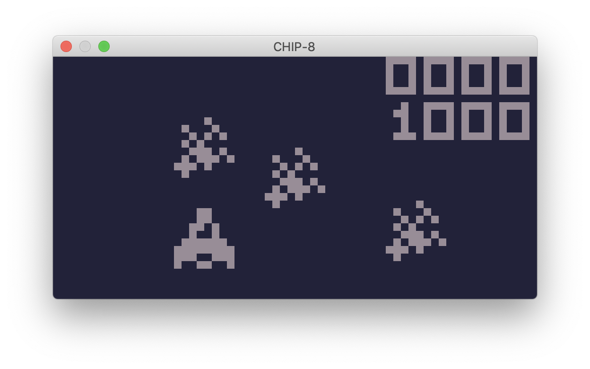
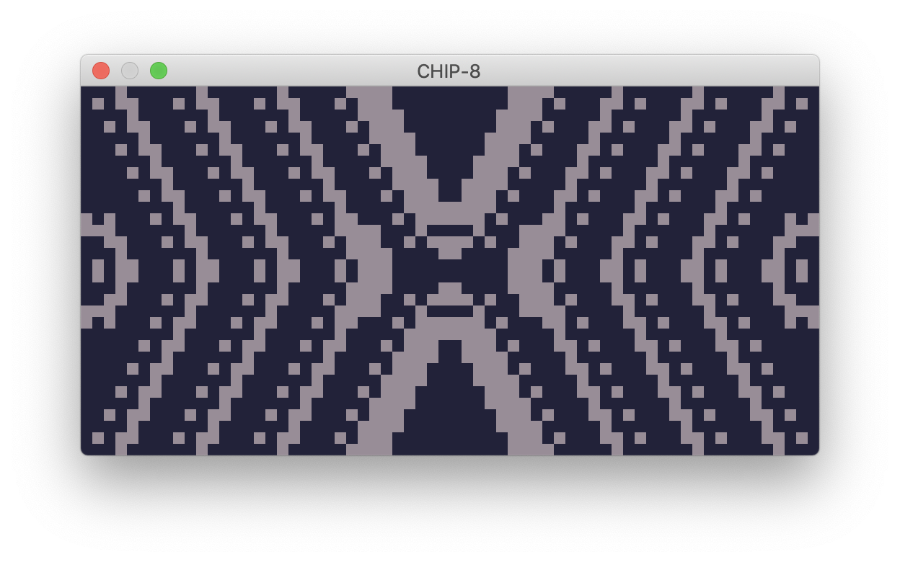
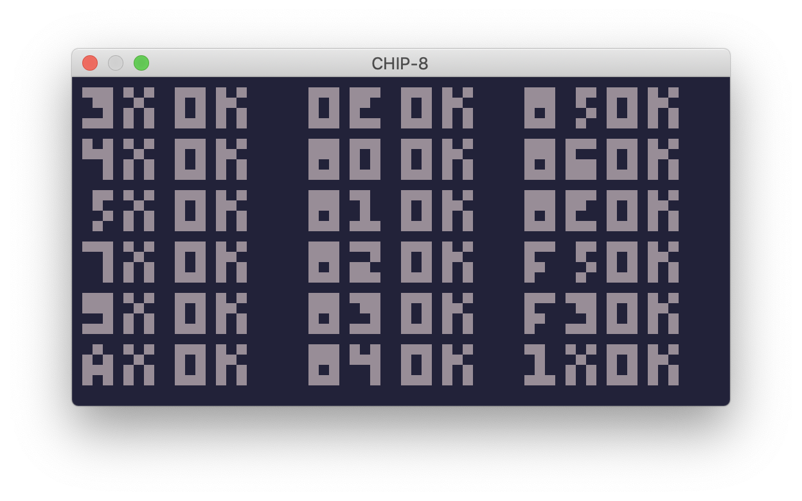

# CHIP-8

```
$ cargo run <PROGRAM>
```

### Resources

- http://devernay.free.fr/hacks/chip8/C8TECH10.HTM
- http://mattmik.com/files/chip8/mastering/chip8.html

#### ROMs

- https://github.com/mattmikolay/chip-8
- https://github.com/dmatlack/chip8/tree/master/roms
- https://github.com/mattmikolay/chip-8
- https://github.com/corax89/chip8-test-rom
- https://www.zophar.net/pdroms/chip8.html

### Screenshots

<p align="center">
  
  
  
  
  
</p>
